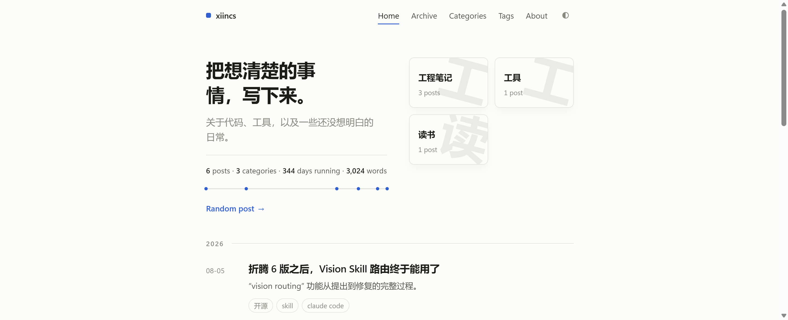

# idyll

[](LICENSE)
[](https://hexo.io)
[](https://github.com/xiincs/hexo-theme-idyll/stargazers)
[](https://github.com/xiincs/hexo-theme-idyll/commits/master)
[](https://github.com/xiincs/hexo-theme-idyll/issues)

**English** | [简体中文](README.zh-CN.md)

A [Hexo](https://hexo.io/) theme built around one idea: get out of the way of the text. Just a stylesheet, semantic HTML, and a handful of scripts that do nothing unless you switch them on — no framework, no build step, no client-side router.



## Design principles

- Background sits a shade warmer than white, text a shade softer than black. Small difference — you feel it by the tenth paragraph, not the first.
- Color has to earn its place. If a tag or a category gets one, it's doing a job, not just sitting there looking nice.
- Hierarchy comes from weight, size, and space before it comes from shadows. When something does need to lift off the page, it gets one of two shadow levels and never more.

## Features

- Bento-grid about page: identity card, bio, skills, and site stats in one layout
- Reading time, word count (CJK- and Latin-aware), and a scroll progress bar
- Auto-generated table of contents and tag-based related posts
- Light / dark / system theme toggle, persisted across visits
- [giscus](https://giscus.app/) comments (GitHub Discussions-backed, free, no tracking)
- Keyboard shortcut panel (hold <kbd>Shift</kbd> for theme toggle / home / random post)
- Copy-to-clipboard code blocks, heading anchors, external-link markers
- Every line above is a config flag. Don't want it? Turn it off.

## Requirements

- Hexo >= 7.0
- Node.js >= 18

## Installation

```bash
cd your-hexo-site
git clone https://github.com/xiincs/hexo-theme-idyll.git themes/idyll
cd themes/idyll && npm install
```

The theme uses [cheerio](https://cheerio.js.org/) to build the table of contents; the `npm install` step above pulls it in locally so you don't need to add it to your site's own `package.json`.

Set the theme in your site's `_config.yml`:

```yaml
theme: idyll
```

## Configuration

All configuration lives in `themes/idyll/_config.yml`. Highlights:

```yaml
hero:
  title: "Write down what you've figured out."
  subtitle: "Code, tools, and things still unclear."

about:
  name: "your name"
  avatar: "https://example.com/avatar.png"
  bio: |
    A short bio, one paragraph per line break.
  skills:
    - JavaScript
    - Python

comment:
  giscus:
    repo: "user/repo"
    repo_id: ""
    category: "Announcements"
    category_id: ""

extras:
  scroll_progress: true
  back_to_top: true
  copy_code: true
  heading_anchor: true
  external_mark: true
  theme_toggle: true
  toc: true
  related_posts: true
  shortcut_panel: true
```

See the comments in `_config.yml` for the full list of options.

## License

[MIT](LICENSE)
